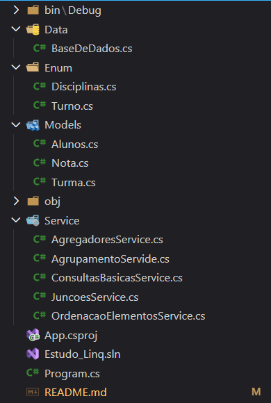

# Estudo de LINQ - Análise Acadêmica (.NET 8)

Este projeto é uma aplicação de console desenvolvida em .NET 8 com o objetivo principal de estudar e demonstrar, de forma prática, as diversas operações e sintaxes do LINQ (Language-Integrated Query).

Para tornar o estudo mais realista, a aplicação simula a geração de relatórios de uma base de dados em memória (mock) de uma instituição de ensino, contendo Alunos, Turmas e Notas. O foco é mostrar como o LINQ pode ser usado para filtrar, projetar, ordenar, agrupar e agregar dados de forma eficiente.

## 🎯 Objetivo

O principal objetivo deste repositório é servir como um portfólio técnico e material de consulta, demonstrando proficiência em C# e LINQ para recrutadores e outros desenvolvedores.

## 🚀 Tecnologias Utilizadas

* **.NET 8**
* **LINQ** (Sintaxe de Método e Sintaxe de Consulta)

## 📂 Estrutura do Projeto

O projeto foi estruturado de forma a separar responsabilidades (Princípio do SRP), facilitando a manutenção e a localização de cada funcionalidade do LINQ:




## ⚙️ Como Clonar e Executar

### Pré-requisitos

* [.NET 8 SDK](https://dotnet.microsoft.com/download/dotnet/8.0)
* [Git](https://git-scm.com/downloads)

### Passos para Execução

1.  Abra seu terminal ou prompt de comando.
2.  Clone este repositório:
    ```sh
    git clone https://github.com/Ca22io/Estudo_Linq
    ```
    (Substitua `SEU_USUARIO/SEU_REPOSITORIO` pelo caminho real do seu projeto)

3.  Navegue até o diretório do projeto:
    ```sh
    cd Estudo_Linq
    ```

4.  Execute a aplicação:
    ```sh
    dotnet run
    ```

## 🖥️ Saída Esperada no Console

Ao executar o comando `dotnet run`, você verá a seguinte saída no console, demonstrando a execução de todas as consultas LINQ:

```
    ----------------------------------------------------
        Filtros (Where) e Projeções (Select)
    ----------------------------------------------------

    --Relatório 1: Alunos da turma 3A:
    Nome: Ana
    Nome: Bruno
    Nome: Carla

    --Relatório 2: Alunos da turma 3A com 18 anos ou mais:
    Nome: Bruno

    --Relatório 3: Nomes de todos os alunos:
    Nome: Ana
    Nome: Bruno
    Nome: Carla
    Nome: Daniel
    Nome: Elisa
    Nome: Felipe

    --Relatório 4: Nome e Idade em meses de todos os alunos:
    Nome: Ana, Idade em meses: 204
    Nome: Bruno, Idade em meses: 216
    Nome: Carla, Idade em meses: 204
    Nome: Daniel, Idade em meses: 216
    Nome: Elisa, Idade em meses: 228
    Nome: Felipe, Idade em meses: 216

    ------------------------------------
        Ordenação de Elementos
    ------------------------------------

    -- Alunos ordenados por nome:
    Ana - 17 anos
    Bruno - 18 anos
    Carla - 17 anos
    Daniel - 18 anos
    Elisa - 19 anos
    Felipe - 18 anos

    -- Alunos ordenados por idade (do mais velho para o mais novo):
    Elisa - 19 anos
    Bruno - 18 anos
    Daniel - 18 anos
    Felipe - 18 anos
    Ana - 17 anos
    Carla - 17 anos

    -- Primeiro aluno da Turma 3B:
    Daniel - 3B

    -- Primeiro aluno da Turma Inexistente (usando FirstOrDefault):
    Nenhum aluno encontrado.

    -- Aluno com Id = 3:
    Carla - Id: 3

    -- Aluno com Id Inexistente (usando SingleOrDefault):
    Nenhum aluno encontrado.

    -------------------------------------
        AGREGAÇÕES COM LINQ
    -------------------------------------

    -- Quantidade de alunos na Turma 3A:
    Total: 3

    -- Média de notas em Matemática:
    Média: 7,42

    -- Notas minimas e máximas em Português:
    Nota mais alta: 9
    Nota mais baixa: 6,5

    -- Soma das notas de Matemática e Português do Aluno 1
    Soma das notas: 17,5

    ------------------------------
        JUNÇÕES (Join)
    ------------------------------

    -- Lista de Alunos com suas respectivas Turmas:
    Aluno: Ana, Turma: 3A
    Aluno: Bruno, Turma: 3A
    Aluno: Carla, Turma: 3A
    Aluno: Daniel, Turma: 3B
    Aluno: Elisa, Turma: 3B
    Aluno: Felipe, Turma: 3B

    -- Relatório de Alunos com suas Turmas e Médias de Notas:
    Aluno: Ana, Turma: 3A, Média de Notas: 8,75
    Aluno: Bruno, Turma: 3A, Média de Notas: 6,75
    Aluno: Carla, Turma: 3A, Média de Notas: 8,75
    Aluno: Daniel, Turma: 3B, Média de Notas: 6,75
    Aluno: Elisa, Turma: 3B, Média de Notas: 8,50
    Aluno: Felipe, Turma: 3B, Média de Notas: 6,25

    ------------------------------
        AGRUPAMENTO (GroupBy)
    ------------------------------

    -- Quantidade de alunos por turma:
    Turma 1: 3 alunos
    Turma 2: 3 alunos

    -- Média de notas por aluno:
    Aluno 1: Média de Notas = 8,75
    Aluno 2: Média de Notas = 6,75
    Aluno 3: Média de Notas = 8,75
    Aluno 4: Média de Notas = 6,75
    Aluno 5: Média de Notas = 8,50
    Aluno 6: Média de Notas = 6,25
```


## 📖 Conceitos de LINQ Demonstrados

A tabela abaixo resume os principais conceitos do LINQ abordados e onde encontrá-los no código-fonte:

| Conceito | Métodos / Sintaxes | Onde Encontrar |
| :--- | :--- | :--- |
| **Filtros e Projeções** | `Where`, `Select`, Projeção com Objeto Anônimo | `Service/ConsultasBasicasService.cs` |
| **Ordenação** | `OrderBy`, `OrderByDescending` | `Service/OrdenacaoElementosService.cs` |
| **Seleção de Elementos** | `First`, `FirstOrDefault`, `Single`, `SingleOrDefault` | `Service/OrdenacaoElementosService.cs` |
| **Agregação** | `Count`, `Average`, `Max`, `Min`, `Sum` | `Service/AgregadoresService.cs` |
| **Junção** | `Join` | `Service/JuncoesService.cs` |
| **Agrupamento** | `GroupBy` | `Service/AgrupamentoService.cs` |